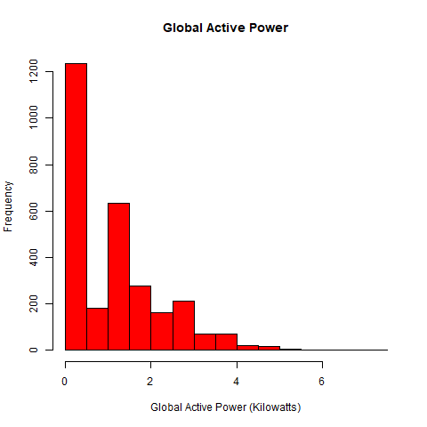
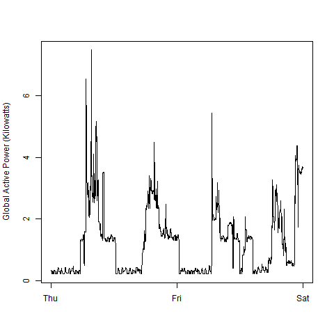
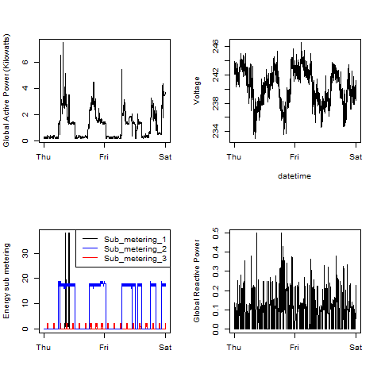

## Introduction
Course project completed as per <a href="https://github.com/rdpeng/ExData_Plotting1/blob/master/README.md">instruction</a>

* <b>Dataset</b>: <a href="https://d396qusza40orc.cloudfront.net/exdata%2Fdata%2Fhousehold_power_consumption.zip">Electric power consumption</a> [20Mb]

Generated plots:

### Plot 1

 

### Plot 2

 

### Plot 3

 

### Plot 4

 

